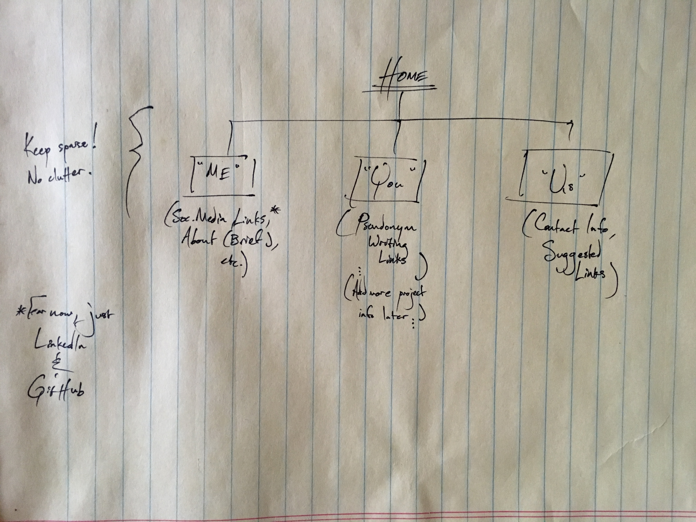

#SITEMAP AHOY! 

1. What are the 6 Phases of Web Design?
  1. info gathering - name your site's purpose, goals, audience, content, etc!
  2. planning - make a site map!
  3. design - determine look/feel of site!
  4. development - take individual graphic elements & create actual functional site! (and deliverables for client)
  5. testing & delivery!
  6. maintainence - repeat customers = new content or products!!!

2. What is your site's primary goal or purpose? What kind of content will your site feature?
  Am I misremembering that the site is supposed to be focused on us? ...Anyway, my site's primary purpose is exhibiting a minimal essential bit of info about myself and projects. I don't envision it as a place that will attract people for its original/ongoing content, more of a little "repository" (LOLLL!) that can serve as both a reference in case of authorial/job candidate interest as well as an area to splash and kick around ideas!

3. What is your target audience's interests and how do you see your site addressing them?
  My target audience for this site is probably very very very small, just people curious about who I am. Well, I'll tell em!

4. What is the primary "action" the user should take when coming to your site? Do you want them to search for information, contact you, or see your portfolio? It's ok to have several actions at once, or different actions for different kinds of visitors.
  See my portfolio and information for *sure.* I have a feeling this is probably pretty common but, hey, that's OK!

5. What are the main things someone should know about design and user experience?
  Put briefly, just that user experience, which is how a person feels when interfacing with a system, is **not** the same as usability, which is user-friendliness & interface efficiency. Design and UX are all about "does the system give me value? is it easy to use and pleasant?"

6. What is user experience design and why is it valuable? 
  Hm, I kind of feel like I answered that above, but it's basically a combination of usability, design, utility, marketing, system performance, ergonomics, human factors, accessibility, and human-computer interaction.

7. Which parts of the challenge did you find tedious?
  None! It was a pretty fun challenge. :)