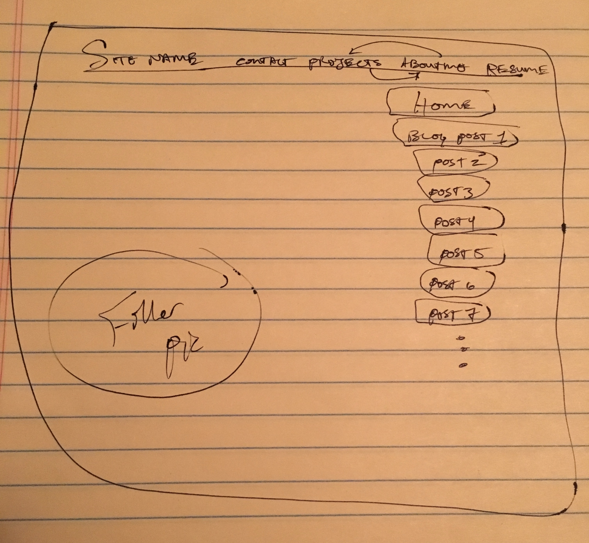

# WIREFRAME REFLECTION!

 wireframe")

- What is a wireframe?
- It's basically a blueprint for your website!

- What are the benefits of wireframing?
- It gives you a better perspective on where you want your design & development to lead. More specifically, it "defines info heirarchy of your design" and determines how users will interact with the interface.

- Did you enjoy wireframing your site?
- Sure did!

- Did you revise your wireframe or stick with your first idea?
- I wound up sticking with my first idea. I'd played around with basic (and extremely simple) and had a good idea of what I wanted. I think it's ultimately doable.

- What questions did you ask during this challenge? What resources did you find to help you answer them?
- My main question was: how am I going to get to the final product?? But, of course, even after some of the basic HTML we've learned this week, it's already a little closer to becoming real. A more specific question: how in the *hell* do these relative paths for images translate to pushed, remote copies stay working? I feel like it sort of just... breaks sometimes. Oh well, probably oversight on my part. Trial and error will take care of it.

- Which parts of the challenge did you enjoy and which parts did you find tedious?
- I enjoyed creating the wireframe and the freedom I felt doing so. It sort of made me think, "work in progress, right. no pressure here, chase whatever cool ideas you have!" The tedious part? Ha, probably just mucking up my GitHub pushes and having to correct and re-correct.